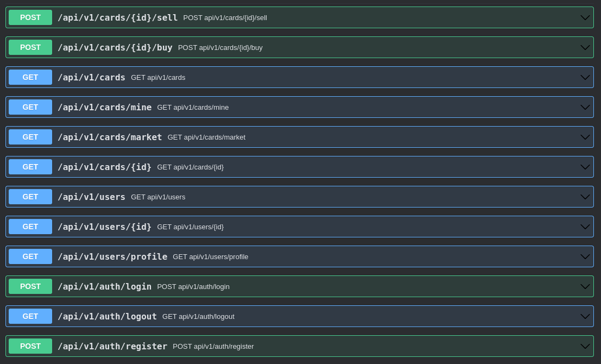

MAILHEBIAU Damien, LAPETITE Mathieu, GRANDHOMME Jean-baptiste, DUBOIS Maxime

# Atelier 1 - Dans le dossier atelier 1

## Static : 

Modification des models de vue fournie sur le gitlab :  
-  https://gitlab.com/js-as1/asi1-visual-content/-/tree/master  

Il permet grâce à atelier1\static\addCard.html de rajouter des cards sur le web-service.  
Pour cela, il utilise la page atelier1\static\createCard.html.   
Celle-ci produit le **POST** sur le web-service. 

Une autre fonctionnalité est présente sur la page atelier1\static\card.html.  
La page permet de chercher une card par le nom sur le web-service.   
Elle affiche la première occurrence. Sinon affiche une erreur en console. 

## Dynamique

Création d'un projet spring avec un moteur de template.   
Le projet spring est disponible sur : 
- atelier1\dynamique

Nous avons réalisé une page création et une page affichage.

### Endpoints disponibles : 
**/addCard :** 

    -> GET : renvoie la page de formulaire

    -> POST : permet de rajouter une card

**/{id}** : 

    -> GET : Permet de chercher une card par son id sur le web-service.

### DAO 
Le Dao joue le role du service, c'est grâce a celui ci que nous allons créer et manipuler les cards sur la base de données H2.
Certaines des fonctions sont prêtes pour une utilisation future (getCardList, deleteCard)...

### Views
Les vues sont réalisées en thymeleaf.

**newCardForm.html** : Page de création de card

**viewCard.html** : Page d'affichage de card

# Atelier 2 - Backend : dossier atelier 2 / Frontend : dossier full-front

## Back :
Pour chaque partie, nous avons créé un controller, un service et un repository.

La base de données est une base postgresql, initié grâce à Hibernate.

Nous avons créé des Entités pour la partie base de données et des DTO pour la partie service et transfert de données. 

Le passage de DTO à Entité est fait grâce à des Mappers.

L'accès à la base de données est fait grâce à des repositories.

### Authentification
- Création d'un utilisateur
- Connexion d'un utilisateur (Avec gestion de token : ici, nous ne passons que le surname non hashé par soucis de simplicité, cependant il serait préférable de passer un token JWT)
- Déconnexion d'un utilisateur
- Récupération de l'utilisateur connecté

### User
- Création d'un utilisateur

### Card
- Création d'une card
- Récupération de toutes les cards
- Récupération de toutes les cards d'un utilisateur
- Récupération d'une card par son id
- Récupération des cards disponibles (celles n'appartenant à aucun utilisateur)

### CardGenerator
- Génération de carte aléatoire 

### Market
- Vente d'une carte (elle devient alors disponible pour tous les utilisateurs)
- Achat d'une carte (elle est alors associée à l'utilisateur qui l'a achetée)

### Liste des endpoints

## Frontend :
- Ajout d'un fichier `api.js` afin de centraliser les requêtes vers le backend
- Légères modifications des fichiers présents afin de prendre en compte notre backend
